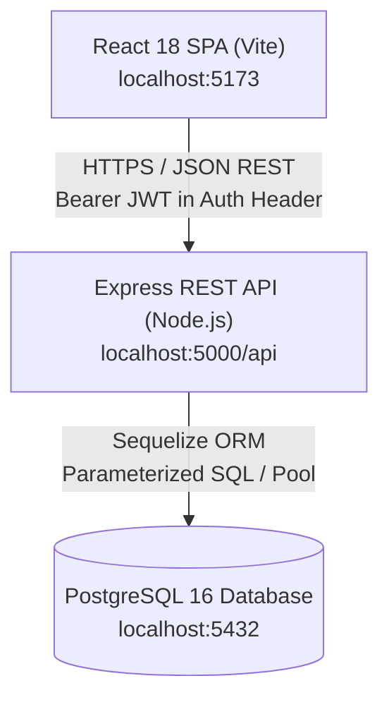
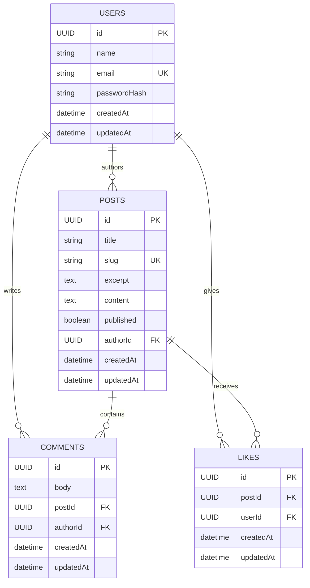
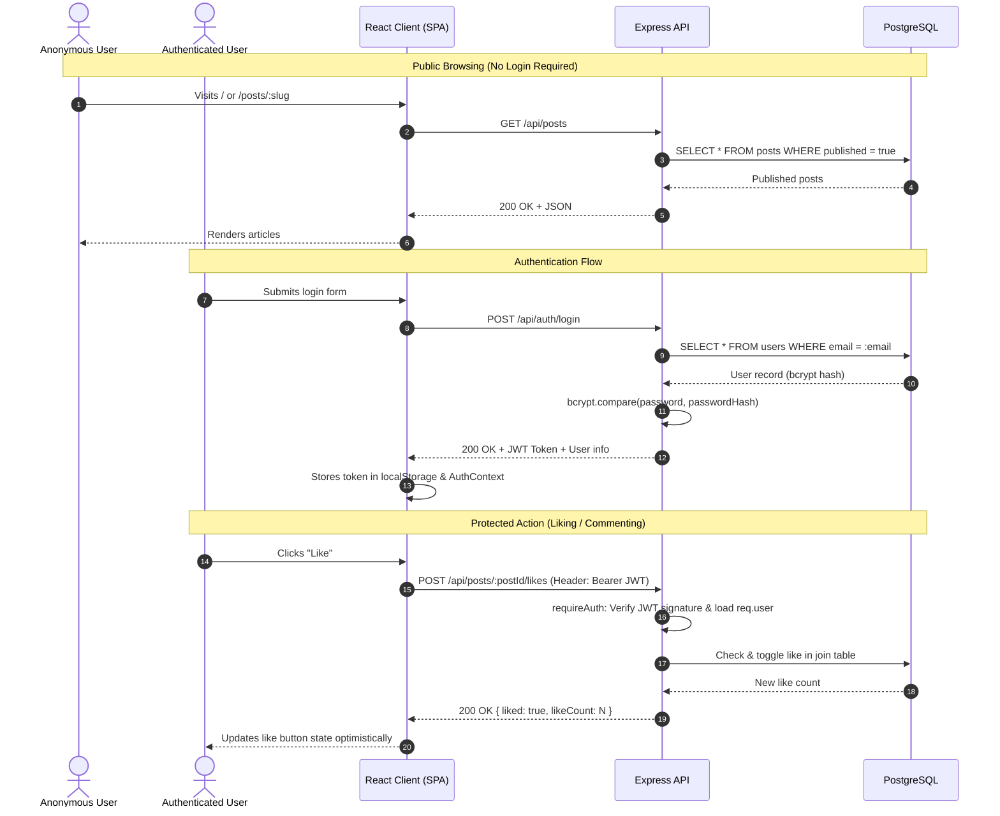

# System Architecture

## Overview

DevEcho / Blog Platform is designed as a classic, resilient three-tier architecture:
1. **Frontend**: React 18 Single-Page Application (SPA) bundled with Vite, offering client-side routing, optimistic UX updates, and responsive glassmorphic interfaces.
2. **Backend**: Stateless Node.js + Express REST API handling authentication, business logic, authorization enforcement, and data validation.
3. **Database**: PostgreSQL 16 managed through Sequelize ORM, enforcing relational consistency, cascades, and composite uniqueness at the database engine level.



---

## Architectural Layers

```
server/src/
├── config/       → Environment-driven database and server configurations
├── models/       → Sequelize model definitions, associations, hooks & constraints
├── middleware/   → Cross-cutting authentication & request lifecycle middleware
├── controllers/  → Request orchestration, data validation, business logic
├── routes/       → Express routers mapping HTTP verbs & paths to controllers
└── server.js     → Entrypoint connecting to DB, synchronizing schema, and booting HTTP listener
```

This strict separation of concerns provides:
- **Decoupled Business Logic**: Controllers do not leak database connection details.
- **Fail-Fast Security**: Middleware verifies JWT signatures and permissions before controllers execute write operations.
- **Testability**: The Express `app` instance is exported independently from `server.js`, enabling sub-second end-to-end integration tests without binding to physical network ports.

---

## Entity Relationship & Data Model



### Relational Constraints & Invariants
- **One Like Per User Per Post**: Enforced via composite unique index `UNIQUE("postId", "userId")` on the `likes` table. Attempting to insert a duplicate like causes an explicit constraint catch, preventing race condition duplicates.
- **Cascade Deletions**: Deleting a post cascades down to automatically remove all related `comments` and `likes`.
- **Slug Uniqueness**: When a post is created, a URL-friendly slug is generated from the title. If collisions exist, an auto-incrementing suffix is appended (`post-title-1`, `post-title-2`).
- **Drafts Privacy**: Posts with `published: false` are excluded by default in public queries (`WHERE published = true`). In individual lookups (`GET /posts/:slug`), non-published posts return a `404 Not Found` unless the requesting user matches `post.authorId`.

---

## Authentication & Authorization Model



### Security Details
- **Password Hashing**: Passwords are encrypted using `bcryptjs` with 10 salt rounds in Sequelize's `beforeCreate` hook. Plaintext passwords are never logged or persisted.
- **Stateless Tokens**: Issued tokens use `HS256` signed by `process.env.JWT_SECRET` with configurable expiration (`7d`).
- **Authorization Guardrails**: Ownership verification occurs strictly server-side:
  - `PUT /api/posts/:id` returns `403 Forbidden` if `post.authorId !== req.user.id`.
  - `DELETE /api/posts/:id` returns `403 Forbidden` if `post.authorId !== req.user.id`.
  - `DELETE /api/comments/:id` returns `403 Forbidden` if `comment.authorId !== req.user.id`.

---

## Frontend Architecture

- **React Router 6**: Manages client-side navigation. Unauthenticated users attempting to access protected routes (`/new`, `/edit/:id`, `/my-posts`) are cleanly redirected to `/login`.
- **AuthContext**: React Context acting as the single source of truth for session management, hydrating automatically from `localStorage` on boot with `GET /api/auth/me`.
- **Axios Interceptor**: Intercepts outgoing requests to append `Authorization: Bearer <token>` when available.
- **Design System**: Vanilla CSS tokens in `index.css` implementing modern glassmorphism, responsive grid layouts, card micro-interactions, and accessible typography.

---

## Technical Trade-offs & Production Roadmap

| Architectural Decision | Justification in Current Scope | Production Roadmap Enhancement |
| :--- | :--- | :--- |
| **Sequelize `sync({ alter: true })`** | Enables rapid development and zero-config table initialization on boot. | Transition to versioned migrations (`sequelize-cli` or Umzug) in CI/CD pipeline. |
| **JWT in localStorage** | Straightforward implementation with clean client-side token management. | Transition to `httpOnly`, `Secure`, `SameSite=Strict` cookies to mitigate XSS vectors. |
| **Single Access Token** | 7-day token avoids refresh token complexity for the exercise. | Introduce short-lived access tokens (15 mins) + rotating refresh tokens in Redis. |
| **Local File/Text Storage** | Post content stored directly as UTF-8 text in PostgreSQL. | Integrate AWS S3 or Cloudinary for rich media / image attachments. |
| **Rate Limiting** | Out of initial exercise scope. | Add `express-rate-limit` on `/api/auth/*` to prevent brute-force credential stuffing. |
